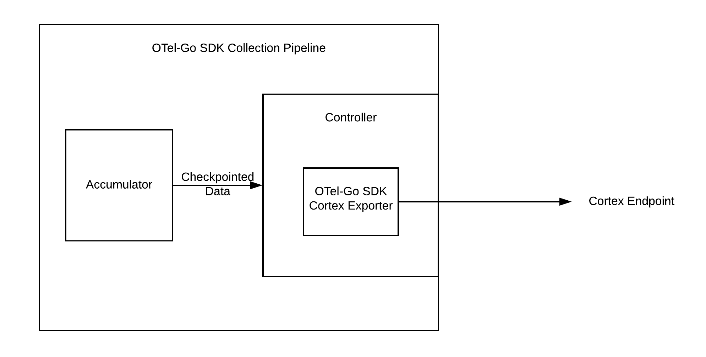
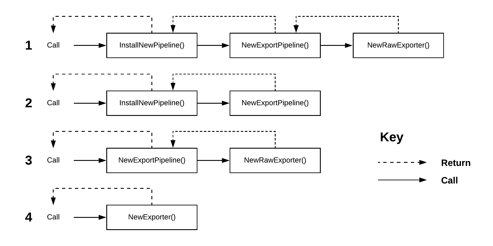
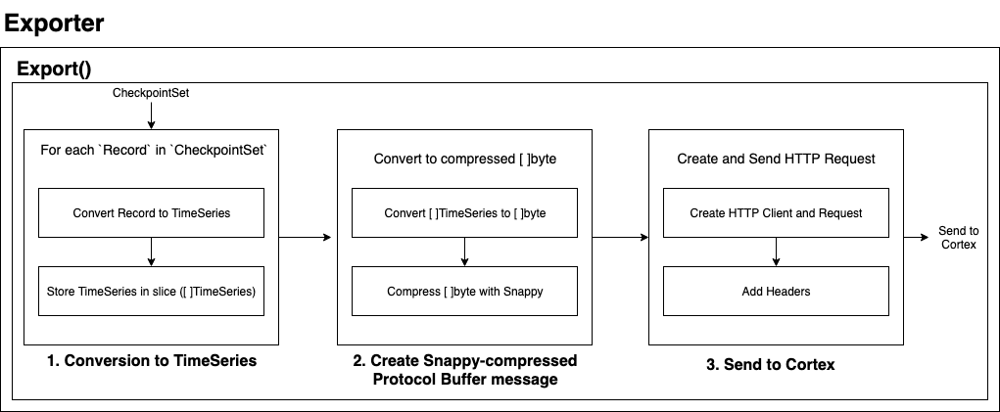
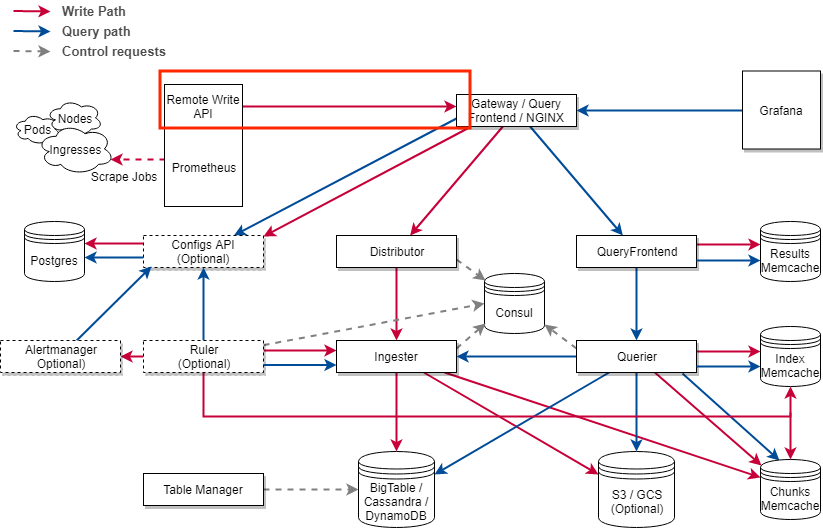

# OpenTelemetry Go SDK Cortex Exporter Design

This document outlines a proposed implementation for the OpenTelemetry Go SDK Cortex Exporter. There
is currently only a
[draft Metrics Exporter Specification](https://github.com/jmacd/opentelemetry-specification/blob/jmacd/draft_metric_sdk_spec/specification/metrics/sdk.md#exporter-implementations),
so this design will be based off of the draft,
[Span Exporter specification](https://github.com/open-telemetry/opentelemetry-specification/blob/master/specification/trace/sdk.md#span-exporter),
and source code from the
[Go Stdout Exporter](https://github.com/open-telemetry/opentelemetry-go/tree/master/exporters/metric/stdout)
and
[Go Prometheus Exporter](https://github.com/open-telemetry/opentelemetry-go/blob/master/exporters/metric/prometheus/prometheus.go).

## Use Cases

 Metrics are raw measurements of resource usage and
behavior of a software system. Metrics provide insight into the behavior and health of systems.
Example metrics include average server latency and total bytes served. By monitoring metrics data,
backend monitoring systems like Prometheus and Cortex can help engineers understand their system,
respond to and prevent service disruptions, and alert end users when necessary.

Our project focuses on delivering an exporter to export metrics data directly from the
OpenTelemetry-Go SDK to Cortex. This is the simplest and most direct way to export metrics to Cortex
from a Go application. Currently, users have to run an instance of Prometheus or the Collector to
perform this export. Our project will eliminate the need to run an entire Prometheus server by
exporting directly to Cortex, as well as eliminate the need to run the Collector. The reduced
complexity will improve developer efficiency, reduce operational cost by not having to run
Prometheus or the Collector, and reduce the opportunity to introduce bugs.

## Design Tenets

1. _Security_ - The Exporter will properly handle authentication by including credentials or signing
   HTTP requests sent to Cortex.
2. _Test Driven Development_ - We will follow TDD practices established by the team and ensure
   proper test coverage (at least 90%).
3. _Scalability_ - The Exporter must operate on sizable systems with predictable overhead growth. It
   cannot consume unbounded memory resources.
4. _Reliability_ - The Exporter should be reliable by gracefully handling errors. Data will either
   all be successfully exported or, in the case of failure, be dropped. Data cannot be modified
   during the export process.
5. _Go Best Practices_ - The Exporter will conform to best practices for Go as described in
   [Effective Go](https://golang.org/doc/effective_go.html).

## Out of Scope

1. _Multiple exporter support_ - The
   [draft Metrics Exporter specification](https://github.com/jmacd/opentelemetry-specification/blob/jmacd/draft_metric_sdk_spec/specification/metrics/sdk.md)
   explains that running multiple Processors and Exporters in parallel would be costly. It states
   that the SDK is not required to provide multiplexing implementations of the Processor or
   Exporter.
2. _Concurrency_ - Because concurrency is handled by the controller in the metrics data pipeline,
   export will never be called concurrently for the same exporter instance according the the
   Exporter specification. Based on this assumption, we will not have to handle concurrency.

3. _Streaming data to Cortex_ - Cortex currently only supports batched data, but streamed data may
   be supported in the future with HTTP/2 support.

## Stretch Goals

1. _Advanced customization_

   - Config instrument to aggregation mapping. Users can modify the AggregatorSelector which is
     passed in when creating a new Push Controller.

2. _Rewrite Labels_ - Nice to have feature which is used by Cortex users but has not been uniformly
   addressed in OpenTelemetry.

## Test Strategy

We will follow TDD practices while completing this project. We’ll write unit tests before
implementing production code. Tests will cover normal and abnormal inputs and test for edge cases.
We will use the [standard Go testing library](https://golang.org/pkg/testing/) and
[Go cmp](https://github.com/google/go-cmp) as described in
[Go Testing Frameworks](https://quip-amazon.com/EC2RAQF5OAtP). Go cmp will handle comparing large or
deep objects like metrics data.

For further testing, we will provide an example setup that collects metrics from a Go application
instrumented by the OpenTelemetry SDK and exports to Cortex, similar to what is done with the
[Prometheus Exporter](https://github.com/open-telemetry/opentelemetry-go/tree/master/example/prometheus).
We will use Docker to let users quickly run the demo application as well as Cortex. We will write
integration tests that will run against the demo application which will ensure the Go SDK, Cortex
Exporter, and Cortex Gateway integrate properly. The
[example folder](https://github.com/open-telemetry/opentelemetry-go/tree/master/example) from the Go
SDK shows several examples of using Docker and Docker Compose to run an example application, like
the
[Zipkin exporter](https://github.com/open-telemetry/opentelemetry-go/tree/master/example/zipkin).


## Go SDK Collection Pipeline

Described below are the existing components from the Go SDK which the Cortex Exporter will integrate
with.


The Go SDK implements a
[Push](https://github.com/open-telemetry/opentelemetry-go/blob/master/sdk/metric/controller/push/push.go)
and a
[Pull](https://github.com/open-telemetry/opentelemetry-go/blob/master/sdk/metric/controller/pull/pull.go)
controller. Cortex expects data to be pushed via the
[remote write API](https://prometheus.io/docs/prometheus/latest/storage/#remote-storage-integrations),
so our exporter will integrate with a Push Controller. The Push Controller will periodically collect
and send metrics to the Exporter. The default interval is 10 seconds and can be configured in the
[Controller](https://github.com/open-telemetry/opentelemetry-go/blob/4f3fab3ba7df677205e673ae743ee067c99dbe87/sdk/metric/controller/push/push.go#L32).

On each interval, the controller will call its
[tick method](https://github.com/open-telemetry/opentelemetry-go/blob/31dd06af9d8add6752adf5f7dea5b9bfb1b9882e/sdk/metric/controller/push/push.go#L138-L154)
which starts the collection on the Processor and calls the `Collect` method on the Accumulator. The
Accumulator then collects metrics from each aggregator. When the metrics are collected, they are
sent to the exporter via the `Export` method described below.

# Cortex Exporter

## Exporter Setup

Users will need to setup this Go-SDK Cortex Exporter in their own Go applications in order to
collect and export metrics data. This section details the pipeline design for setting up the
Exporter and Push Controller. The steps in this pipeline are:

1. Create and configure an instance of the Go-SDK Cortex Exporter
2. Create and configure a Push Controller with the newly created Exporter
3. Register the Meter Provider from the newly created Controller globally
4. Return the Push Controller to the user

### Pipeline Functions

While the steps above remain similar for exporters in the Go SDK and Go Contrib, there are a couple
function combinations that these other exporters use in their Exporter Installation pipelines:



- `InstallNewPipeline()` → `NewExportPipeline()` → `NewRawExporter()`
  - [Stdout Exporter (metrics)](https://github.com/open-telemetry/opentelemetry-go/tree/master/exporters/stdout)
  - [DogStatsD (metrics)](https://github.com/open-telemetry/opentelemetry-go-contrib/tree/master/exporters/metric/dogstatsd)

* `InstallNewPipeline()` + `NewExportPipeline()`
  - [Prometheus Exporter (metrics)](https://github.com/open-telemetry/opentelemetry-go/blob/master/exporters/metric/prometheus/prometheus.go)
* `NewExportPipeline()` + `NewRawExporter()`
  - [Jaeger Exporter (traces)](https://github.com/open-telemetry/opentelemetry-go/blob/master/exporters/trace/jaeger/jaeger.go)
* `NewExporter()`

  - [Datadog (metrics)](https://github.com/open-telemetry/opentelemetry-go-contrib/tree/master/exporters/metric/datadog)
  - [Stdout Exporter (traces)](https://github.com/open-telemetry/opentelemetry-go/blob/master/exporters/trace/stdout/stdout.go)
  - [Zipkin Exporter (traces)](https://github.com/open-telemetry/opentelemetry-go/blob/master/exporters/trace/zipkin/zipkin.go)

For this exporter, we will use the same function naming terminology from previous exporters.
However, there does not appear to be a standard for how the functions are named, so we decided on
using `InstallNewPipeline()`, `NewExportPipeline()`, and `NewRawExporter()`.

We chose these three functions over the other combinations because:

1. `InstallNewPipeline()` and `NewExportPipeline()` is clearer than `NewExportPipeline()` alone.
   `NewExportPipeline()` doesn’t suggest anything about registering the Provider whereas the word
   install does
2. It provides a clear separation of duties — `InstallNewPipeline()` registers the Controller,
   `NewExportPipeline()` configures / creates the Controller, and `NewRawExporter()` configures /
   creates the Exporter
   - Not using `NewRawExporter()` means `NewExportPipeline()` handles configuring / creating both
     the Exporter and the Controller
3. `NewExporter()` does not suggest anything about a Controller; furthermore, the function may
   become very large as everything would be contained within it.

**Proposed Installation Pipeline:**


```go
func InstallNewPipeline(config Config, options ...push.Option) (*push.Controller, error) {
    // 1. Gets a Controller from NewExportPipeline(config, options)
    controller := NewExportPipeline(...)

    // 2. Registers controller.Provider() globally
    // 3. Returns the Controller
}

func NewExportPipeline(config Config, options ...push.Option) (*push.Controller, error) {
    // 1. Gets an Exporter from NewRawExporter(config)
    exporter := NewRawExporter(...)

    // 2. Create a new *push.Controller with Exporter
    controller := push.New(...)

    // 3. Start the Controller
    // 4. Returns the Controller
}

func NewRawExporter(config Config) (*Exporter, error) {
    // 1. Check configuration properties
    //     a. Check passed in properties for errors
    //     b. Set default values for missing properties
    // 2. Create new Exporter based on configuration properties
    // 3. Return the created Exporter

    if property != nil && property is valid {
        // Apply config property
    }
    // ...
}
```

### Config

The first input for the Exporter Installation pipeline is a Config struct. It will be copied over to
a new Exporter struct and the properties it contains will be validated.

```go
type Exporter struct {
    // Config struct
    // ...
}

type Config struct {
    // ... Configuration settings
    // Custom HTTP Client (more details below)
}

```

The Exporter provides a function that creates a valid Config struct for the user from a YAML file;
however, the user can also create and pass in their own Config struct. The function to create the
Config struct relies on the external dependency [Viper](https://github.com/spf13/viper). Viper is a
library that handles finding, loading, and unmarshalling configuration files. The YAML file will
need to contain the information in Prometheus’s remote_write configuration file. Some of these
settings will be added as headers to the HTTP request later.

The file allows the user to configure basic authentication through an Authorization header and TLS.
The Exporter does not enforce the use of TLS as Cortex does not require it. Users can also provide a
custom HTTP client that will handle signing and authentication for other protocols such as AWS IAM.

Here is the demo configuration file taken from the Prometheus website
([link](https://prometheus.io/docs/prometheus/latest/configuration/configuration/#remote_write)).
Some of the configurations will not be used because they are Prometheus-specific. They are labeled
with comments below.

```yaml
# The URL of the endpoint to send samples to.
url: <string> (https://prometheus.io/docs/prometheus/latest/configuration/configuration/#string)

# Timeout for requests to the remote write endpoint.
[ remote_timeout: <duration> (https://prometheus.io/docs/prometheus/latest/configuration/configuration/#duration) | default = 30s ]

# NOTE: A stretch goal; not needed for exporter to work, but good to have.
# List of remote write relabel configurations.
write_relabel_configs:
  [ - <relabel_config> (https://prometheus.io/docs/prometheus/latest/configuration/configuration/#relabel_config) ... ]

# Name of the remote write config, which if specified must be unique among remote write configs.
# The name will be used in metrics and logging in place of a generated value to help users distinguish between
# remote write configs.
[ name: <string> (https://prometheus.io/docs/prometheus/latest/configuration/configuration/#string) ]

# Sets the `Authorization` header on every remote write request with the
# configured username and password.
# password and password_file are mutually exclusive.
basic_auth:
  [ username: <string> (https://prometheus.io/docs/prometheus/latest/configuration/configuration/#string) ]
  [ password: <string> (https://prometheus.io/docs/prometheus/latest/configuration/configuration/#string) ]
  [ password_file: <string> (https://prometheus.io/docs/prometheus/latest/configuration/configuration/#string) ]

# Sets the `Authorization` header on every remote write request with
# the configured bearer token. It is mutually exclusive with `bearer_token_file`.
[ bearer_token: <string> (https://prometheus.io/docs/prometheus/latest/configuration/configuration/#string) ]

# Sets the `Authorization` header on every remote write request with the bearer token
# read from the configured file. It is mutually exclusive with `bearer_token`.
[ bearer_token_file: /path/to/bearer/token/file ]

# Configures the remote write request's TLS settings.
tls_config:
  [ <tls_config> (https://prometheus.io/docs/prometheus/latest/configuration/configuration/#tls_config) ] # NOTE: Is detailed below

# Optional proxy URL.
[ proxy_url: <string> (https://prometheus.io/docs/prometheus/latest/configuration/configuration/#string) ]

# NOTE: UNUSED BY THIS EXPORTER
# Configures the queue used to write to remote storage.
queue_config:
  # Number of samples to buffer per shard before we block reading of more
  # samples from the WAL. It is recommended to have enough capacity in each
  # shard to buffer several requests to keep throughput up while processing
  # occasional slow remote requests.
  [ capacity: <int> | default = 500 ]
  # Maximum number of shards, i.e. amount of concurrency.
  [ max_shards: <int> | default = 1000 ]
  # Minimum number of shards, i.e. amount of concurrency.
  [ min_shards: <int> | default = 1 ]
  # Maximum number of samples per send.
  [ max_samples_per_send: <int> | default = 100]
  # Maximum time a sample will wait in buffer.
  [ batch_send_deadline: <duration> (https://prometheus.io/docs/prometheus/latest/configuration/configuration/#duration) | default = 5s ]
  # Initial retry delay. Gets doubled for every retry.
  [ min_backoff: <duration> (https://prometheus.io/docs/prometheus/latest/configuration/configuration/#duration) | default = 30ms ]
  # Maximum retry delay.
  [ max_backoff: <duration> (https://prometheus.io/docs/prometheus/latest/configuration/configuration/#duration) | default = 100ms ]

```

Here is the configuration for `tls_config`.

```yaml
# CA certificate to validate API server certificate with.
[ ca_file: <filename> (https://prometheus.io/docs/prometheus/latest/configuration/configuration/#filename) ]

# Certificate and key files for client cert authentication to the server.
[ cert_file: <filename> (https://prometheus.io/docs/prometheus/latest/configuration/configuration/#filename) ]
[ key_file: <filename> (https://prometheus.io/docs/prometheus/latest/configuration/configuration/#filename) ]

# ServerName extension to indicate the name of the server.
# https://tools.ietf.org/html/rfc4366#section-3.1
[ server_name: <string> (https://prometheus.io/docs/prometheus/latest/configuration/configuration/#string) ]

# Disable validation of the server certificate.
[ insecure_skip_verify: <boolean> (https://prometheus.io/docs/prometheus/latest/configuration/configuration/#boolean) ]

```

### Options

```go
func ...(config Config, options ...push.Option) (...) { ... }
```

If the last parameter of a Go function is `...T` where `T` is a type, it means the function will
accept any number of parameters of type `T`. In the `InstallNewPipeline()` case, the function
accepts any number of `push.Option`. ([src](https://programming.guide/go/three-dots-ellipsis.html))

Option are used to configure the Controller when it is being created. It is already implemented by
the SDK in
[push.go](https://github.com/open-telemetry/opentelemetry-go/blob/master/sdk/metric/controller/push/push.go)
and
[config.go](https://github.com/open-telemetry/opentelemetry-go/blob/master/sdk/metric/controller/push/config.go)
from the
[controller/push](https://github.com/open-telemetry/opentelemetry-go/tree/master/sdk/metric/controller/push)
package.

```go
// This is already implemented -- from config.go
// Note: This is NOT the same Config as the first argument.

// Config (Controller) contains configuration for a push Controller.
type Config struct {
    // Resource is the OpenTelemetry resource associated with all Meters
    // created by the Controller.
    Resource *resource.Resource

    // Period is the interval between calls to Collect a checkpoint.
    Period time.Duration

    // Timeout is the duration a collection (i.e. collect, accumulate,
    // integrate, and export) can last before it is canceled. Defaults to
    // the controller push period.
    Timeout time.Duration
}

// Option is the interface that applies the value to a configuration option.
type Option interface {
    // Apply sets the Option value of a Config.
    Apply(*Config)
}

func (o timeoutOption) Apply(config *Config) {
    config.Timeout = time.Duration(o)
}

// ... other Apply functions ...

// WithPeriod sets the Period configuration option of a Config.
func WithPeriod(period time.Duration) Option {
    return periodOption(period)
}
```

Generally, this Config struct isn’t created. Instead, Options are passed in by calling multiple
`push.With_` methods as shown below. Here is an example from
[push_test.go](https://github.com/open-telemetry/opentelemetry-go/blob/master/sdk/metric/controller/push/push_test.go#L145-L149)

```go
// From push_test.go
p := push.New(
    test.AggregatorSelector(),
    fix.exporter,
    push.WithPeriod(time.Second),
    push.WithResource(testResource),
)
meter := p.Provider().Meter("name")
```

### Custom HTTP Client

Users may wish to implement their own authentication if the options supported in the YAML file are
insufficient. The Exporter allows the user to choose between using what is in the Config struct and
providing their own custom HTTP client. The custom client will be passed into the Config struct
during the Exporter setup pipeline to handle signing and authentication. The default option will be
to use the Config struct.

## Exporter Interface

The SDK defines a metrics exporter interface in
[metric.go](https://github.com/open-telemetry/opentelemetry-go/blob/master/sdk/export/metric/metric.go)
that must be implemented. The Controller relies on this Exporter interface because it calls the
Export method.

The interface has two functions, `Export()` and `ExportKindFor()` described below. In addition to
the exporter interface methods, the Cortex Exporter will have methods for installation, conversion
to TimeSeries, and sending to Cortex.

### Export

```go
func Export(ctx context.Context, checkpointSet CheckpointSet) error {
    // 1. convertToTimeSeries()
    timeSeries := convertToTimeSeries(checkpointSet)

    // 2. BuildMessage()
    message := BuildMessage(timeSeries)

    // 3. SendRequest()
    SendRequest(message)
}
```

Export receives a batch of metrics data in the form of a `CheckpointSet`. Export then converts the
CheckpointSet to TimeSeries by calling `convertToTimeSeries()`. It then calls `BuildMessage()` and
`SendRequest()` functions which will build and send an HTTP request with the TimeSeries to Cortex.
These methods are described in detail below.



### ExportKindFor

```go
func ExportKindFor(*metric.Descriptor, aggregation.Kind) export.ExportKind {
    return export.CumulativeExporter
}
```

ExportKindFor should return the correct ExportKind that should be used when exporting data for the
given metric instrument and aggregator kind. ExportKindFor returns an integer value that identifies
what type of aggregation to use. The possible aggregation types are:

- `CumulativeExporter` (e.g. for Prometheus) - Exporter expects a Cumulative aggregation
- `DeltaExporter` (e.g. for StatsD) - Exporter expects a Delta aggregation
- `PassThroughExporter` (e.g. stdout or OTLP) - The Exporter does not require maintaining state for
  the given instrument.

The `ExportKind` is used by the
[Processor](https://github.com/open-telemetry/opentelemetry-go/blob/master/sdk/metric/processor/basic/basic.go#L374-L408)
to decide how to handle aggregation start and interval timestamps and state appropriately for each
instrument.

The Cortex Exporter should always return `CumulativeExporter`, which is expected by Prometheus and
Cortex.

### Shutdown

The Span Exporter specification requires a `Shutdown` method on the Exporter interface. At the time
of writing, none of the Go Exporters implement this method and it is not required for Metrics
Exporters. If the Metrics Exporter specification changes to include this requirement or we find the
need for a Shutdown method, we will modify the design to include it.

## Convert to TimeSeries

Cortex expects to receive a slice of `TimeSeries`. Prometheus defines TimeSeries in the
[Protocol Buffer format](https://developers.google.com/protocol-buffers) in
[types.proto](https://github.com/prometheus/prometheus/blob/master/prompb/types.proto). These proto
files can be compiled into `.pb.go` files which expose structs that implement the types defined in
the proto files.

_Structs from types.pb.go_

```go
// TimeSeries represents samples and labels for a single time series.
type TimeSeries struct {
    Labels []Label
    Samples []Sample
}

type Label struct {
    Name string
    Value string
}

type Sample struct {
    Value float64
    Timestamp int64
}
```

The `convertToTimeSeries` method will handle the conversion from CheckpointSet to TimeSeries. Based
on the aggregation type defined by `AggregatorSelector` defined when creating the Push Controller,
`convertToTimeSeries` will call helper functions like `convertFromSum`, `convertFromLastValue`, etc.

```go
func convertToTimeSeries(checkpointSet CheckpointSet) (TimeSeries, error) {
    // Iterate through each record in the CheckpointSet with ForEach()
    //     a. Retrieve Descriptor, Aggregation, and NumberKind
    //     b. Convert into a TimeSeries depending on the aggregation type
    //     c. Store TimeSeries in a slice of TimeSeries
    // Return slice of TimeSeries
}
```

The Go SDK implements
[several aggregation types](https://github.com/open-telemetry/opentelemetry-go/blob/master/sdk/export/metric/aggregation/aggregation.go).
Based on the aggregation type, the data will have to be converted to TimeSeries differently based on
how the data is structured by the aggregation. Currently Go has the following aggregation types:
Sum, MinMaxSumCount, LastValue, Points, Distribution, and Histogram.

It is likely that new aggregation types will be implemented by the SDK or users. As is standard in
the other Go Exporters, our Exporter will decide how to handle aggregation type based on type
conversion rather than aggregator Kind value, so any new aggregators that implement an aggregation
described below will be handled correctly. Unknown aggregations will be ignored as is standard in
the other Exporters.

### Data mapping

The CheckpointSet includes a `ForEach` method which iterates over each `Record` in the
CheckpointSet.

```go
type Record struct {
  Metadata {
      descriptor *metric.Descriptor
      labels     *label.Set
      resource   *resource.Resource
  }
  aggregation aggregation.Aggregation
  start       time.Time
  end         time.Time
}
```

Based on the Record’s aggregation type, one or more `TimeSeries` will be created as described below.
Each `TimeSeries` will have a slice of `Labels` which will include the Record’s labels and the
metric name which is included in the Record’s descriptor. Each `Sample` will use the end timestamp
from the Record as this is value associated with the current cumulation period. The following
conversions are based on the
[Prometheus documentation](https://prometheus.io/docs/concepts/metric_types/#histogram). This
[OTEP](https://github.com/open-telemetry/oteps/pull/118) provides additional information as how to
how the aggregations should be converted.

**Sum**

Each Sum will create one TimeSeries. The Sum value will be used as a Sample Value. It will include
the metric name as a label.

**LastValue**

Each LastValue will create one TimeSeries. The LastValue value will be used as a Sample Value. It
will include the metric name as a label.

**MinMaxSumCount**

Each MinMaxSumCount will create four TimeSeries. The sum, min, max, and count values will each map
to a TimeSeries with a direct mapping from the value to Sample Value. Each TimeSeries will include
the metric name as a label plus an appropriate identifier like `metric_name_min`, `metric_name_max`,
etc.

**Histogram**

Each Histogram with n buckets will create 3 + n TimeSeries.

- 1 TimeSeries will contain the histogram count. Will include `metric_name_count` as label.
- 1 TimeSeries will contain the histogram sum. Will include `metric_name_sum` as label.
- n TimeSeries will contain the bucket counts with the upper boundary as a label. Will include
  `metric_name{le="upperbound"}` as label.
- 1 TimeSeries will contain the bucket counts with infinity as the upper boundary. Will include
  `metric_name{le="+Inf"}` as label. This is the same as count, but is required by
  [Prometheus](https://prometheus.io/docs/concepts/metric_types/#histogram).

**Distribution**

Each Distribution will produce 4 + n TimeSeries.

- 4 TimeSeries for Min, Max, Sum, and Count as is done by MinMaxSumCount.
- n TimeSeries for each Quantile. Will include `metric_name{quantile="value"}` as Label.

**Points**

The Points aggregation will be handled as a Distribution as explained in this OTEP
(https://github.com/open-telemetry/oteps/pull/118).

## Send TimeSeries to Cortex

This section covers how the OTel-Go SDK Cortex Exporter sends the TimeSeries metrics data to Cortex.

### Remote Write API

Data can be pushed to Cortex through Prometheus’s `remote_write` API, which sends batched
[Snappy](https://google.github.io/snappy/)-compressed
[Protocol Buffer](https://developers.google.com/protocol-buffers/) messages (`[]byte`) inside of a
HTTP PUT/POST request to a Cortex endpoint. This Cortex endpoint may be part of a managed Prometheus
service which may require additional authentication such as AWS Sig v4. Proprietary authentication
will not be directly supported by the Exporter; however, the Exporter will allow the user to pass in
their own HTTP client so they can add it themselves.



There are two things to be done:

1. Build the compressed `[]byte`
2. Build and send the HTTP request

### Building the compressed []byte

The goal is to convert a slice of TimeSeries (`[]TimeSeries`) from the previous section to a
compressed slice of bytes (`[]byte`).

Prometheus uses a `WriteRequest` struct that is exposed by
r[emote.proto.go](https://github.com/prometheus/prometheus/blob/master/prompb/remote.pb.go), which
is compiled from
[remote.proto](https://github.com/prometheus/prometheus/blob/master/prompb/remote.proto). _The
conversion between the two proto files is already implemented and provided by the protobuf package._

```go
// WriteRequest definition in remote.proto
message WriteRequest {
  repeated prometheus.TimeSeries timeseries = 1 [(gogoproto.nullable) = false];
}

// WriteRequest struct in remote.pb.go
type WriteRequest struct {
    Timeseries []TimeSeries `protobuf:"bytes,1,rep,name=timeseries,proto3" json:"timeseries"`
}
```

The slice of TimeSeries will be wrapped by this WriteRequest struct. Next, it needs to be converted
to a `[]byte`. This is done through Go’s `protobuf` package, which can do so with its `Marshal()`
method. See
[Google’s tutorial on protobuf](https://developers.google.com/protocol-buffers/docs/gotutorial).
`Marshal()` requires uses of the `pb.go` files defined in the
[prompb folder](https://github.com/prometheus/prometheus/tree/master/prompb) and results in an
uncompressed `[]byte`. Lastly, the `[]byte` needs to be compressed with Snappy.

[Snappy](https://github.com/golang/snappy) is a compression / decompression library that focuses on
high speeds and reasonable compression. It has two formats: block and stream. This design uses the
block format because our Exporter sends data in batches instead of streaming it. Streamed data is
currently not supported by Cortex, but may be come in the future with HTTP/2 support. It provides an
`Encode()` method which returns a compressed slice of bytes `[]byte`.

```go
func buildMessage (timeseries []TimeSeries) ([]byte, error) {
     // 1. Create WriteRequest

    // 2. Convert WriteRequest to []byte
    uncompressed := proto.Marshal(...) // uncompressed is []byte

    // 3. Compress []byte to []byte
    compressed := snappy.Encode(...) // compressed is []byte

    return compressed
}
```

### Compressed []byte → HTTP request


After the compressed `[]byte` is created, it needs to be put inside a HTTP request and sent to
Cortex with the correct headers attached. The design will rely on `http.Client` from Go’s native
`http` [package](https://golang.org/pkg/net/http/). A new Client is created by default, but the
Exporter will use the user provided custom HTTP client if one exists. The settings that were defined
in the Config struct are then added to the Client’s request. Afterwards, it is sent to the endpoint
defined in the Config struct.

The response will be logged by the Exporter. The export process succeeds if the HTTP response is
HTTP 200 and fails otherwise. There will be a timeout for the response, but retries will be limited
as they are costly performance-wise and will require a queue to send the data in the correct order.
In general, failures can be ignored because even if TimeSeries are dropped, cumulative aggregations
will reflect the missing metrics data.

Example: Imagine a counter that gets incremented 5 times, with an Export happening between each
increment. If the exports happen like this: SUCCESS, SUCCESS, FAIL, FAIL, SUCCESS, the exported data
will be 1, 2, _, _, 5. The result is the same because the Exporter uses a cumulative aggregation.

```go
func buildRequest(compressed []byte) error {
    req, err := http.NewRequest(...)
    req = AddHeaders(req) // Add headers from Config
    res, err := client.Do(req) // Send off the request!
}
```

```go
func AddHeaders(req http.Request) error {
    req.Header.Add(...)
    req.Header.Add(...)
    req.Header.Add(...)
    // ... Add all the headers
}
```

```go
func (e *Exporter) sendRequest() error {
    // Create new http client if one wasn't provided
    // Send request
    // Handle retry logic
}
```

## Error Handling

Methods and functions in the Exporter always return an error at least. This error is used to notify
the user that something hs gone wrong.

### Exporter Setup Pipeline

If a function in the Exporter setup pipeline encounters an error, it will return it to its caller.
Errors in the pipeline “move up” and are eventually returned to the user.

```go
func InstallNewPipeline(config Config, options ...push.Option) (*push.Controller, error) {
    // ...
}

// Example main function
func main() {
    pusher, err := InstallNewPipeline(config, push.WithPeriod(...))
    if err != nil {
        // Handle error here
    }
}
```

### Export()

The metrics Exporter interface requires `Export()` to return an error. Methods that `Export()` calls
will also return an error. Similar to the Exporter Setup pipeline, errors will be returned to the
caller and eventually be returned by `Export()` and passed to the Go API’s global error handler
([link](https://github.com/open-telemetry/opentelemetry-go/blob/c6611f44785883c1d5dfa712a3464493d285dba6/sdk/metric/controller/push/push.go#L151-L153)).

### Global Error Handler

The Go API provides a global error handler
([link](https://github.com/open-telemetry/opentelemetry-go/blob/c6611f4478/api/global/handler.go))
that implements the oterror.Handler interface, which requires a Handle() method. OpenTelemetry
components can use it to log errors to stdout.
