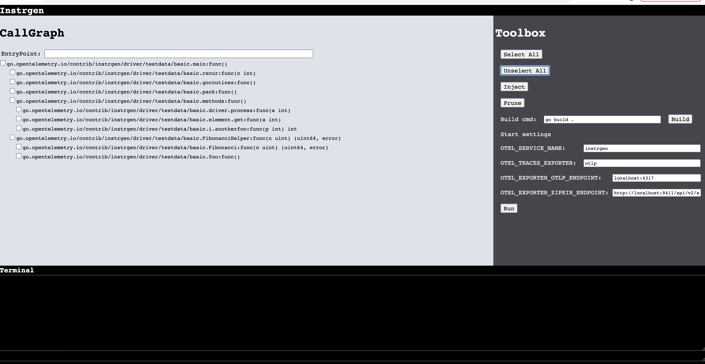

# OpenTelemetry Go Source Automatic Instrumentation - design

This document describes design of `instrgen` - compile time automatic OpenTelemetry instrumentation for GO programming language.

## Background

Usually techniques used for instrumenting programs in specific languages are connected to runtimes and type systems
used by these languages and depend on capabilities offered by them. Methods differs depending on language properties.
Are they executed by virtual machine? Are they statically or dynamically typed?
Language and its internals influence instrumentation techniques.
In dynamic languages it's very easy to replace original implementation. This is done by providing a new
implementation built on top of the original one. A technique called monkey patching (i.e. Python decorators).

GO is statically typed, natively compiled programming language which means that works on bare methal without
virtual machine in between. The only component that lives between your program and machine is operating system.
Because of this limitation, auto-instrumentation of Go programs is limited to the following:

1. Auto-instrument within the kernel itself (i.e. [eBPF](https://ebpf.io/))
2. Auto-instrument during compilation of the program

The second approach is taken by `instrgen`.

## Rationale

Compile time instrumentation is not different by other mechanisms described above.
The fundamental difference is the injection point, instrumentation has to be done 
at compile time which has cons and pros.

GO is perfect language for compile time instrumentation for two main reasons:
- everything that's needed is in standard library
- it's easy to control compilation process due to go compiler architecture

## Design

As mentioned above `instrgen` utilizes toolexec compiler switch (https://github.com/open-telemetry/opentelemetry-go-contrib/pull/4058/).

**NOTE** `driver` executable needs to be accessible via $PATH

### Flow
`instrgen` driver has two passes. First pass prepares some configuration for second pass based on provided settings,
it means that the same process is executed twice in different context.

It was designed and implemented this way to take input directly from user via command line switches and to do some
initial analysis, however this can be spit into two separate tools or processes.

`driver --inject  /testdata/basic yes main.main`

Executable takes few parameters:

- command name
- file pattern - determines files taken into instrumentation
- yes/no - determines whether code should be injected in-place
- entry point - a function from which injection process start

```sh
usage driver --command [file pattern] replace entrypoint
    command:
	inject                                 (injects open telemetry calls into project code)
	prune                                  (prune open telemetry calls
```

Below is the configuration generated by first pass and read by second one, when
driver is executed as go compiler plugin.

```json
{
"ProjectPath": ".",
"FilePattern": "/testdata/basic",
"Cmd": "inject",
"Replace": "yes",
"EntryPoint": {
    "Pkg": "main",
    "FunName": "main"
 }
}
```

First pass trigger the second one using following command:

```sh
go build -work -a -toolexec driver
```

### Instrumentation

`instrgen` has modular architecture and to add instrumentation for new package, 2 steps are needed,
implementation of specific `PackageRewriter` and its registration.

```go
// PackageRewriter interface does actual input package
// rewriting according to specific criteria.
type PackageRewriter interface {
        // ID Dumps rewriter id.
        Id() string
        // Inject tells whether package should be rewritten.
        Inject(pkg string, filepath string) bool
        // ReplaceSource decides whether input sources should be replaced
        // or all rewriting work should be done in temporary location.
        ReplaceSource(pkg string, filePath string) bool
        // Rewrite does actual package rewriting.
        Rewrite(pkg string, file *ast.File, fset *token.FileSet, trace *os.File)
        // WriteExtraFiles generate additional files that will be linked
        // together to input package.
        // Additional files have to be returned as array of file names.
        WriteExtraFiles(pkg string, destPath string) []string
}
```


#### Example rewriter

```go
// FunDumper rewrites all functions according to FilePattern.
type FunDumper struct {
}

// Id.
func (FunDumper) Id() string {
        return "FunDumper"
}

// Inject.
func (fd FunDumper) Inject(pkg string, filepath string) bool {
	return true
}

// ReplaceSource.
func (fd FunDumper) ReplaceSource(pkg string, filePath string) bool {
        return true
}

func makeStmts(name string) []ast.Stmt
	s := &ast.ExprStmt {
		X: &ast.CallExpr {
			Fun: &ast.SelectorExpr {
				X: &ast.Ident {
					Name: "__myfmt",
				},
				Sel: &ast.Ident {
					Name: "Println",
				},
			},
			Lparen: 42,
			Args: []ast.Expr {
				&ast.BasicLit {
					ValuePos: 43,
					Kind: STRING,
					Value: "\" + name +\"",
				},
			},
			Ellipsis: 0,
		},
	}
        return []ast.Stmt{s}

// Rewrite.
func (fd FunDumper) Rewrite(pkg string, file *ast.File, fset *token.FileSet, trace *os.File) {
        visited := make(map[string]bool, 0)
        ast.Inspect(file, func(n ast.Node) bool {
                if funDeclNode, ok := n.(*ast.FuncDecl); ok {
                        // check if functions has been already instrumented
                        if _, ok := visited[fset.Position(file.Pos()).String()+":"+funDeclNode.Name.Name]; !ok {
                                funDeclNode.Body.List = append(makeStmts(funDeclNode.Name.Name), funDeclNode.Body.List...)
                                astutil.AddNamedImport(fset, file, "__myfmt", "fmt")
                                visited[fset.Position(file.Pos()).String()+":"+funDeclNode.Name.Name] = true
                        }
                }
                return true
        })
}

// WriteExtraFiles.
func (FunDumper) WriteExtraFiles(pkg string, destPath string) []string {
        return nil
}
```

### UI

To lower usage barrier to user `instrgen` offers simple UI where instrumentations of specific functions and libraries
can be selected.



### Context passing
