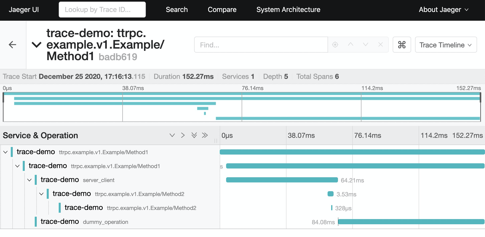

# ttrpc Tracing Example

Traces client and server calls via interceptors for [ttrpc](https://github.com/containerd/ttrpc), and based on `ttrpc`'s [example](https://github.com/containerd/ttrpc/tree/master/example).

## Build

```
$ cd $GOPATH/src/go.opentelemetry.io/contrib/instrumentation/github.com/containerd/ttrpc/otelttrpc/example/cmd
$ go build
```

This will build with default executable file named `cmd`.

## Run server

If there has no `JAEGER_HOST` been set, will use `stdout` exporter.

```
$ export JAEGER_HOST=localhost
$ ./cmd serever
```

## Run client

```
$ export JAEGER_HOST=localhost
$ ./cmd client foo bar
```

## Screenshot

This is one screenshot of `ttrpc` and `jaeger`.


